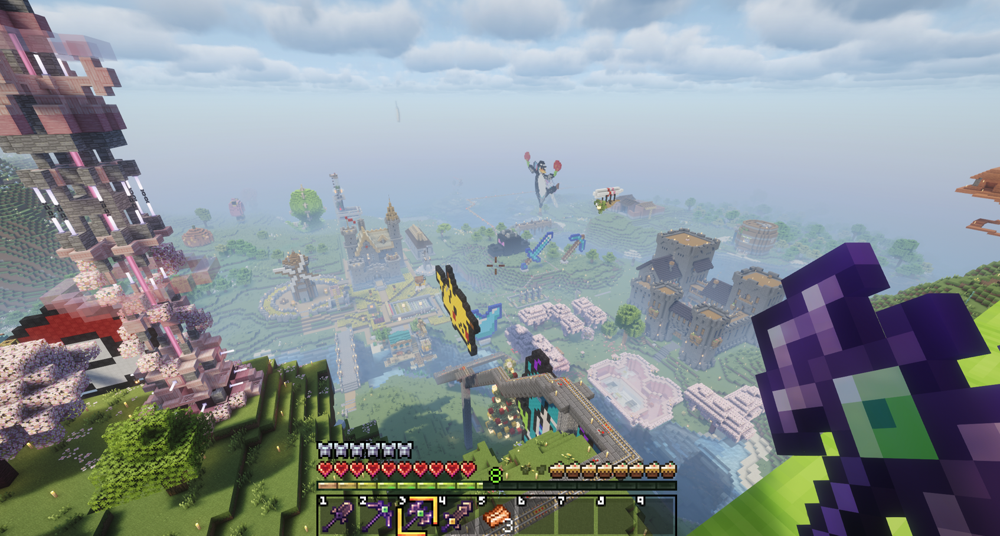
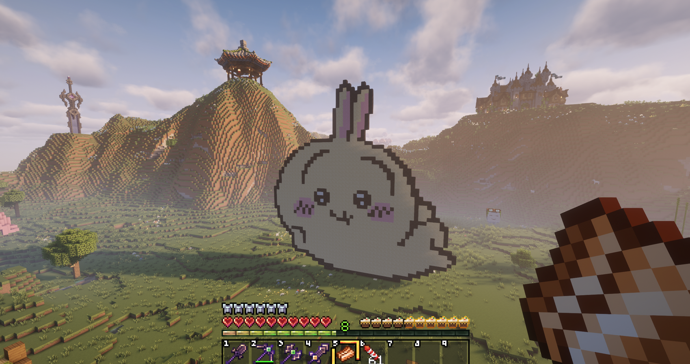
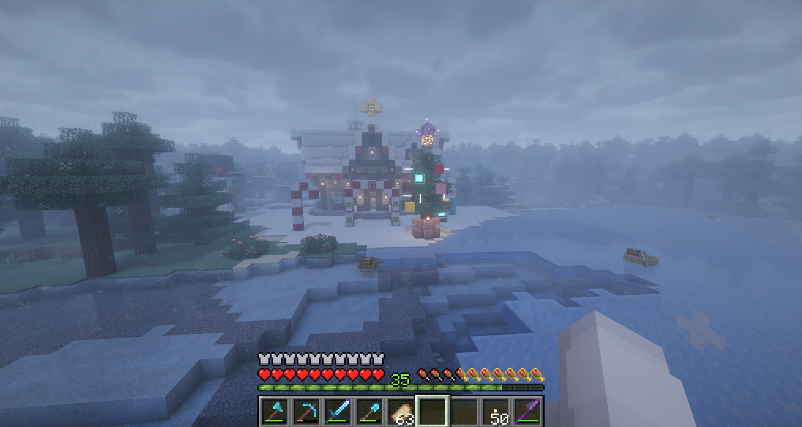

# Vanilla Plus Plus (vpp) Modpack

## Overview
A lightweight modpack designed to enhance the vanilla Minecraft experience. It focuses on quality-of-life improvements, visual enhancements, and minor gameplay tweaks without changing the core vanilla mechanics.

## Features
- Supported Minecraft Version: **1.21.10**, **1.21.11**
- Server Compatibility: Works seamlessly with a vanilla server
- Enhanced vanilla experience  
- Quality-of-life improvements  
- Visual and performance optimizations

## Gallery

